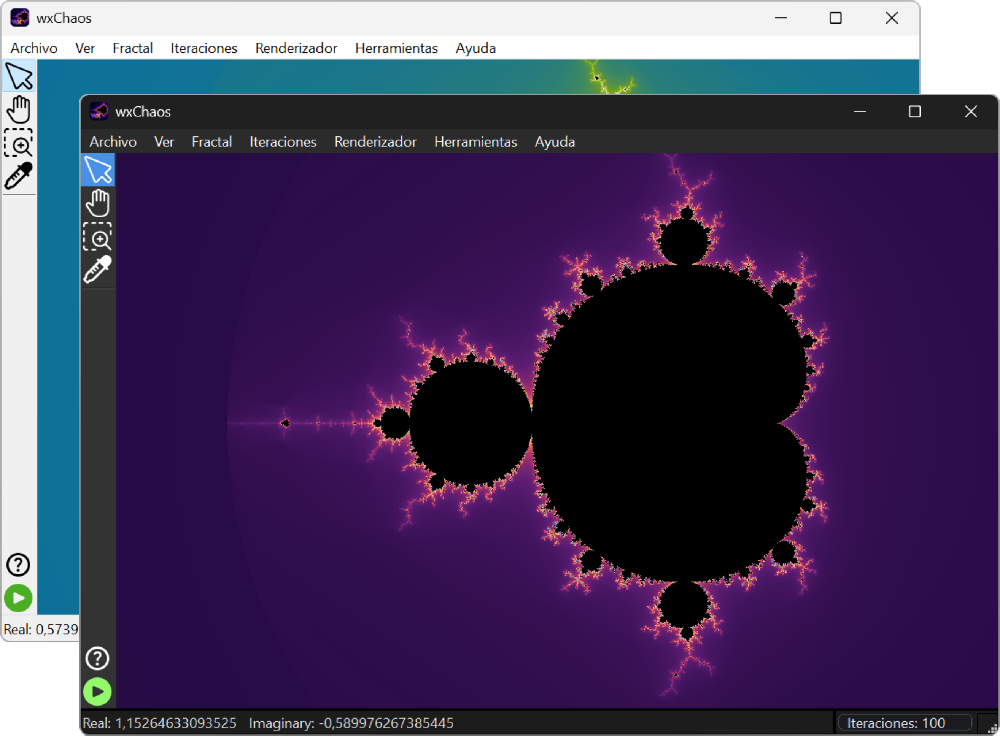
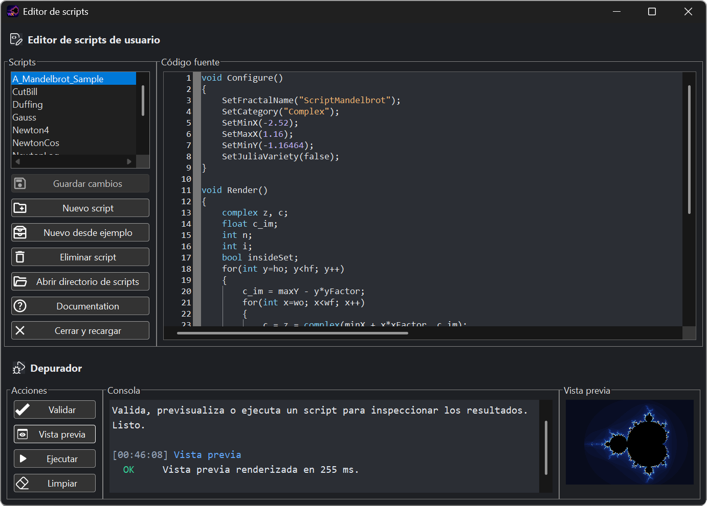
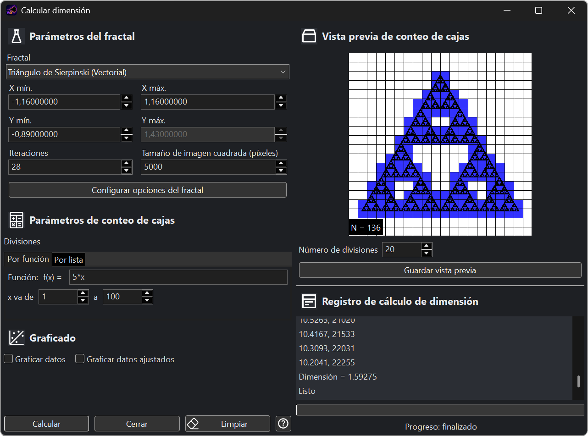
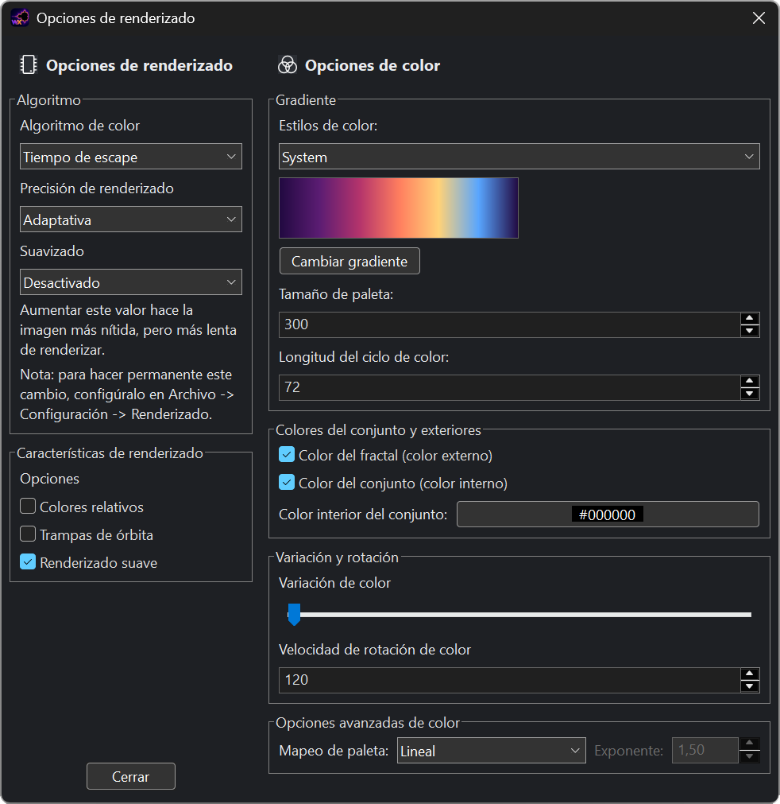
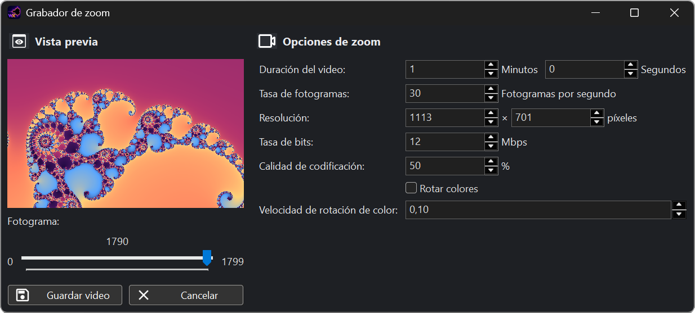
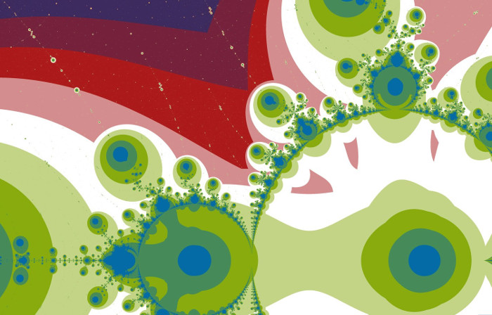
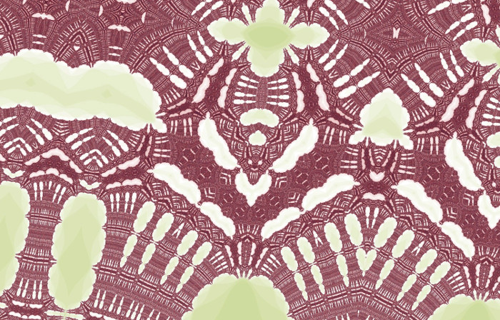

  

  <a href="README.md">English</a>
  &nbsp;|&nbsp;
  <strong>Español</strong>
  &nbsp;|&nbsp;
  <a href="README.ja.md">日本語</a>

  <strong>Un explorador de fractales interactivo para descubrir, comprender y crear patrones complejos.</strong>

  <a href="https://github.com/CarlosManuelRodr/wxChaos/releases/latest"><strong>Descargar la versión más reciente</strong></a>
  &nbsp;&middot;&nbsp;
  <a href="Build.md">Compilar desde el código fuente</a>
  &nbsp;&middot;&nbsp;
  <a href="https://github.com/CarlosManuelRodr/wxChaos/issues">Reportar un problema</a>

wxChaos es una aplicación de código abierto para explorar fractales mediante
la interacción directa. Recorre conjuntos conocidos, sigue la órbita detrás de
un punto, compara métodos de renderizado, abre una vista previa de Julia o
examina las matemáticas sin salir de la aplicación.

Incluye fractales clásicos del plano complejo, mapas caóticos, sistemas
numéricos y construcciones vectoriales. La colección abarca desde los conjuntos
de Mandelbrot y Julia hasta las cuencas de Newton, Burning Ship, los mapas de
Henon y Logístico, el péndulo doble, las construcciones de Sierpinski y el copo
de nieve de Koch.

## Qué Puedes Hacer

- **Explorar con libertad.** Desplázate, haz zoom, vuelve a vistas anteriores,
  inspecciona coordenadas y muévete entre espacios de parámetros y espacios
  dinámicos relacionados.
- **Observar cómo se construye la imagen.** Muestra las órbitas de los puntos,
  selecciona constantes de Julia, inspecciona valores con el selector de puntos
  y utiliza documentación interactiva que conecta las explicaciones
  directamente con la aplicación.
- **Cambiar el renderizado.** Experimenta con paletas, coloreado suave, trampas
  de órbita, coloreado por enteros gaussianos, ángulos de escape, desigualdad
  triangular y otros algoritmos compatibles con cada fractal.
- **Crear tus propios fractales.** Introduce fórmulas personalizadas o utiliza
  la interfaz de AngelScript para definir fractales completos con opciones,
  lógica de renderizado, órbitas y documentación propia.
- **Medir y grabar.** Estima la dimensión por conteo de cajas, exporta imágenes
  y crea vídeos a partir de una secuencia de acercamientos.
- **Trabajar con el tema y el idioma que prefieras.** La interfaz y la
  documentación incluida son compatibles con temas claros y oscuros, además
  de español e inglés.

## Aprende Mientras Exploras

Cada fractal puede tener su propia página de documentación ilustrada. Estas
páginas presentan primero la idea visual y dejan disponibles los detalles
matemáticos para cuando quieras profundizar. Los enlaces interactivos pueden
abrir un fractal, cambiar su coloreado, activar una herramienta o ir
directamente a una ubicación destacada.

Varias páginas también incluyen pequeñas simulaciones y laboratorios de
iteración. Así, fórmulas como la iteración de Mandelbrot, el método de
Newton-Raphson y las ecuaciones del péndulo doble pueden observarse paso a paso
en lugar de tratarse como notación estática.

## Herramientas

| Editor de scripts | Calculadora de dimensión |
|:--:|:--:|
| Escribe y ejecuta fractales programados sin volver a compilar wxChaos. | Estima la dimensión fractal mediante el método de conteo de cajas. |
|  |  |

| Opciones del renderizador | Grabador de zoom |
|:--:|:--:|
| Elige el algoritmo de coloreado, la paleta, la precisión, el suavizado, las trampas de órbita y otros controles de renderizado. | Exporta un vídeo a partir de una secuencia de vistas seleccionadas. |
|  |  |

## Galería

<table>
  <tr>
    <td></td>
    <td></td>
  </tr>
  <tr>
    <td></td>
    <td></td>
  </tr>
</table>

## Descarga

Obtén la versión empaquetada más reciente desde el
[último lanzamiento en GitHub](https://github.com/CarlosManuelRodr/wxChaos/releases/latest).
Las versiones anteriores y sus notas están disponibles en la
[página de lanzamientos](https://github.com/CarlosManuelRodr/wxChaos/releases).

## Compilar Desde el Código Fuente

wxChaos puede compilarse en Windows y Linux mediante CMake. Las dependencias,
opciones de configuración, notas específicas de cada plataforma y comandos
verificados están documentados en [Build.md](Build.md).

## Contribuir

Los reportes de errores y las mejoras concretas son bienvenidos. Utiliza el
[sistema de incidencias](https://github.com/CarlosManuelRodr/wxChaos/issues)
para informar de problemas, proponer funciones y participar en la discusión.

## Licencia

wxChaos es software libre publicado bajo la
[Licencia Pública General de GNU, versión 3](License).
