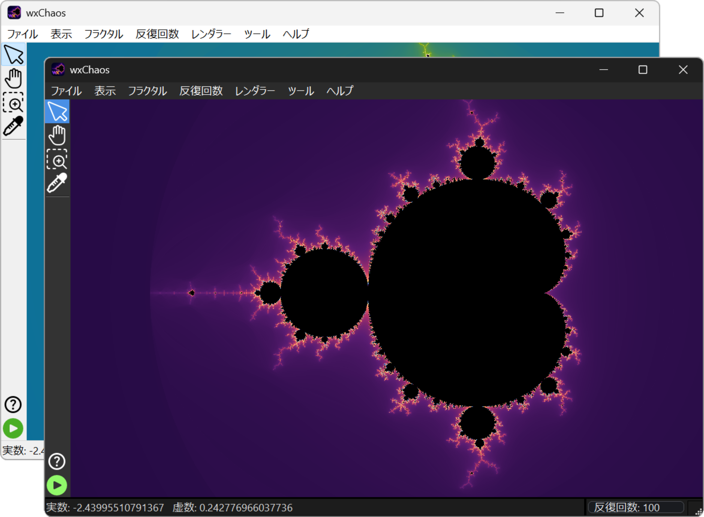
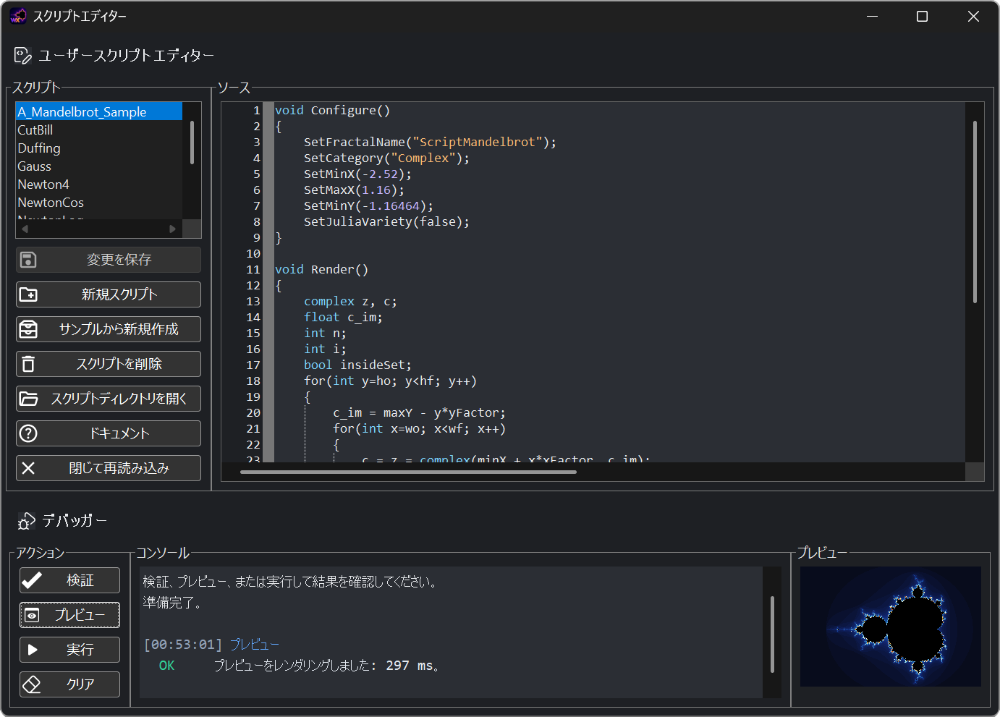
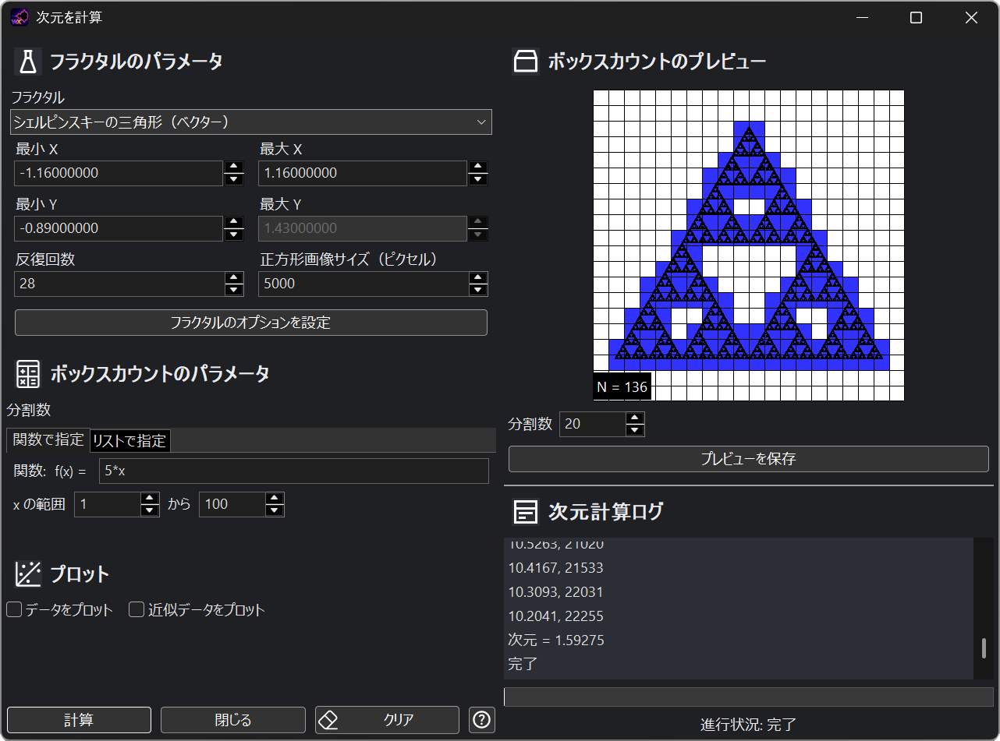
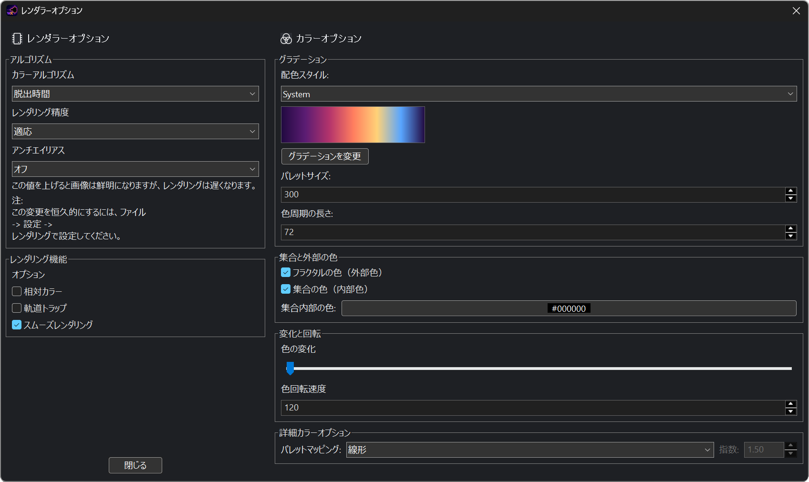
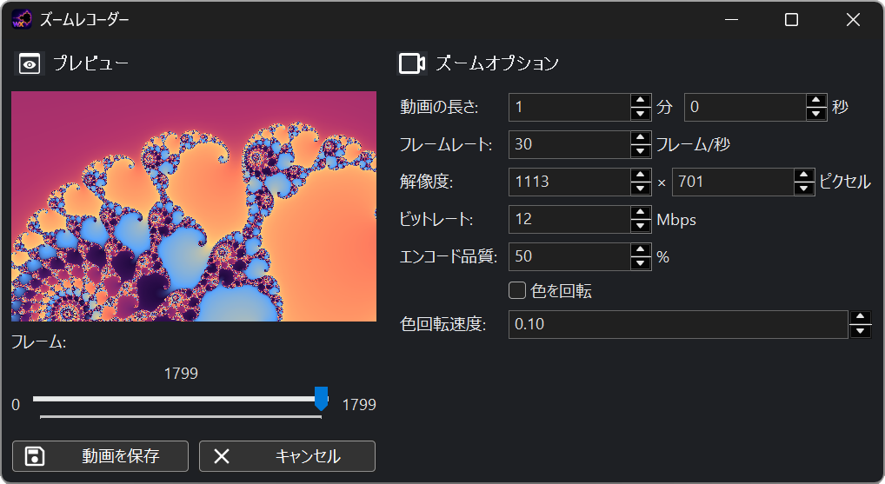

  

  <a href="README.md">English</a>
  &nbsp;|&nbsp;
  <a href="README.es.md">Español</a>
  &nbsp;|&nbsp;
  <strong>日本語</strong>

  <strong>複雑なパターンを探索し、その仕組みを理解し、自分で作るためのインタラクティブなフラクタル探索アプリケーションです。</strong>

  <a href="https://github.com/CarlosManuelRodr/wxChaos/releases/latest"><strong>最新版をダウンロード</strong></a>
  &nbsp;&middot;&nbsp;
  <a href="Build.md">ソースからビルド</a>
  &nbsp;&middot;&nbsp;
  <a href="https://github.com/CarlosManuelRodr/wxChaos/issues">問題を報告</a>

wxChaosは、直接操作しながらフラクタルを探索できるオープンソースの
アプリケーションです。よく知られた集合の中を移動し、点の軌道をたどり、
描画方法を比較し、Juliaプレビューを開き、アプリケーションを離れることなく
数学的な仕組みを確認できます。

複素平面上の古典的なフラクタルだけでなく、カオス写像、数値計算による
システム、ベクター図形による構成も収録しています。Mandelbrot集合や
Julia集合から、Newton法の吸引域、Burning Ship、Henon写像とLogistic写像、
二重振り子、Sierpinski図形、Koch雪片まで、幅広い対象を探索できます。

## 主な機能

- **自由に探索。** パンやズーム、以前の表示への復帰、座標の確認ができ、
  関連するパラメータ空間と力学系平面の間を行き来できます。
- **画像が作られる過程を観察。** 点の軌道を表示し、Julia定数を選択し、
  ポイントピッカーで値を調べられます。インタラクティブなドキュメントから
  アプリケーションを直接操作することもできます。
- **描画方法を変更。** パレット、スムーズカラーリング、軌道トラップ、
  ガウス整数カラーリング、発散角、三角不等式など、各フラクタルが対応する
  アルゴリズムを試せます。
- **独自のフラクタルを作成。** 数式を入力する方法に加え、AngelScript
  インターフェースを使って、オプション、描画ロジック、軌道、専用
  ドキュメントを備えたフラクタルを定義できます。
- **測定と記録。** ボックスカウント法による次元の推定、静止画の
  エクスポート、連続するズームからの動画作成ができます。
- **好みのテーマと言語で使用。** インターフェースと付属ドキュメントは
  ライトテーマとダークテーマ、および英語とスペイン語に対応しています。

## 探索しながら学ぶ

各フラクタルには、図を使った専用のドキュメントページを用意できます。
まず視覚的な考え方を紹介し、必要に応じて数学的な詳細を読める構成です。
インタラクティブなリンクから、フラクタルを開く、配色を変更する、
ツールを有効にする、注目すべき場所へ直接移動するといった操作ができます。

いくつかのページには、小さなシミュレーションや反復計算ラボもあります。
Mandelbrot反復、Newton-Raphson法、二重振り子の方程式などを、静的な
数式として読むだけでなく、段階ごとに観察できます。

## ツール

| スクリプトエディター | 次元計算 |
|:--:|:--:|
| wxChaosを再ビルドせずに、スクリプトによるフラクタルを記述して実行できます。 | ボックスカウント法でフラクタル次元を推定します。 |
|  |  |

| レンダラー設定 | ズームレコーダー |
|:--:|:--:|
| カラーリングアルゴリズム、パレット、精度、スムージング、軌道トラップなどの描画設定を変更できます。 | 選択した複数のズーム表示から動画をエクスポートします。 |
|  |  |

## ギャラリー

<table>
  <tr>
    <td></td>
    <td></td>
  </tr>
  <tr>
    <td></td>
    <td></td>
  </tr>
</table>

## ダウンロード

最新のパッケージ版は
[GitHubの最新リリース](https://github.com/CarlosManuelRodr/wxChaos/releases/latest)
から入手できます。過去のバージョンとリリースノートは
[リリース一覧](https://github.com/CarlosManuelRodr/wxChaos/releases)にあります。

## ソースからビルド

wxChaosは、CMakeを使用してWindowsおよびLinux上でビルドできます。
依存関係、設定オプション、各プラットフォームの注意事項、検証済みの
コマンドについては[Build.md](Build.md)を参照してください。

## コントリビューション

バグ報告や目的の明確な改善を歓迎します。問題の報告、機能の提案、
ディスカッションには
[Issueトラッカー](https://github.com/CarlosManuelRodr/wxChaos/issues)
をご利用ください。

## ライセンス

wxChaosは
[GNU General Public Licenseバージョン3](License)
の下で公開されているフリーソフトウェアです。
