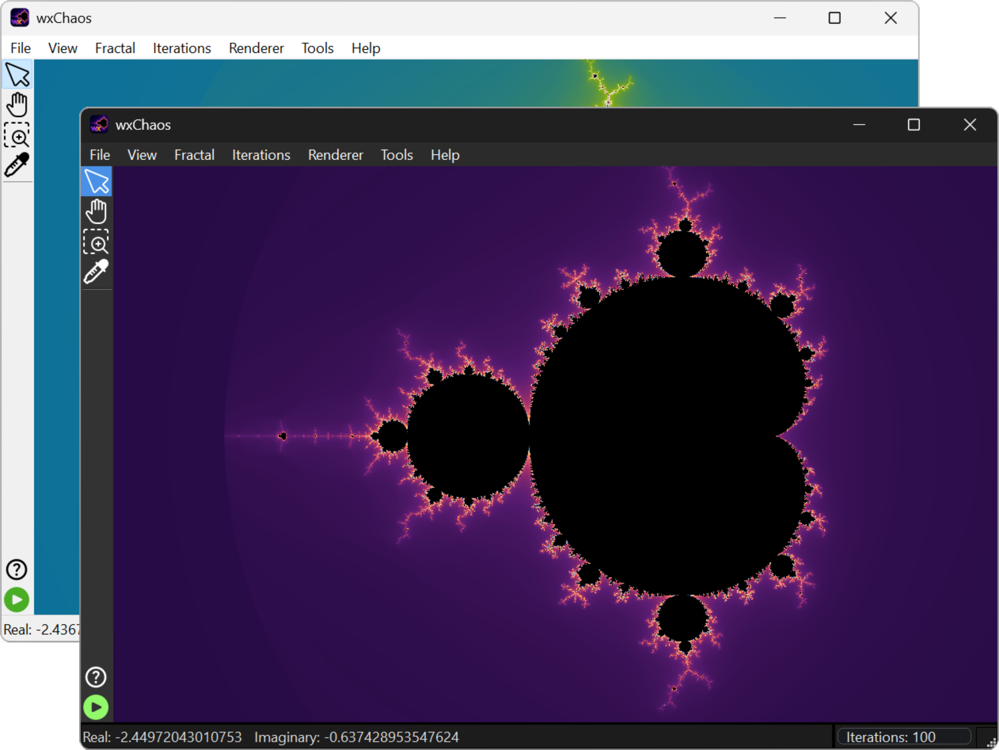
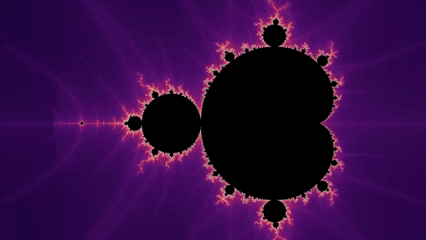
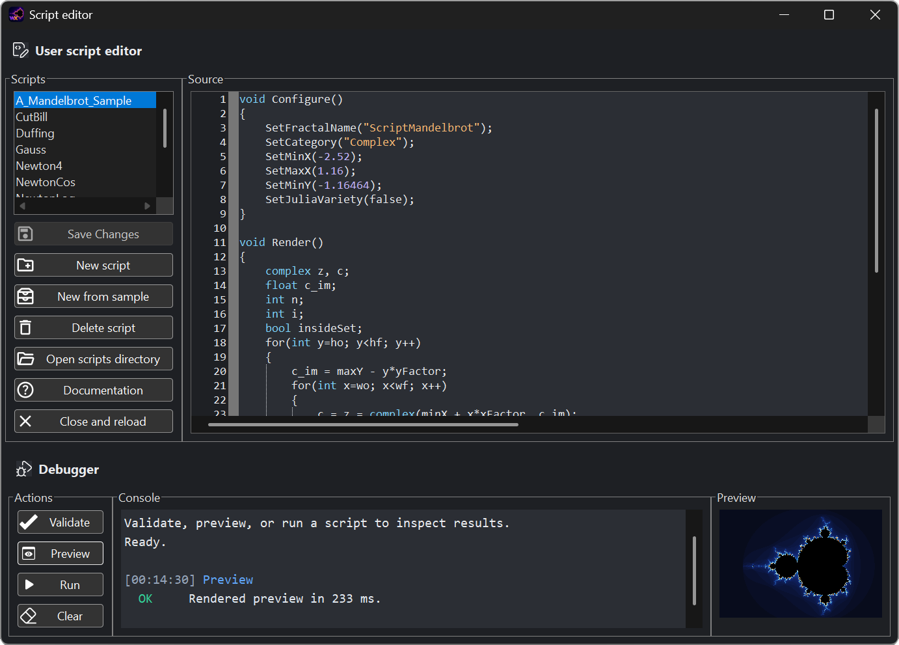
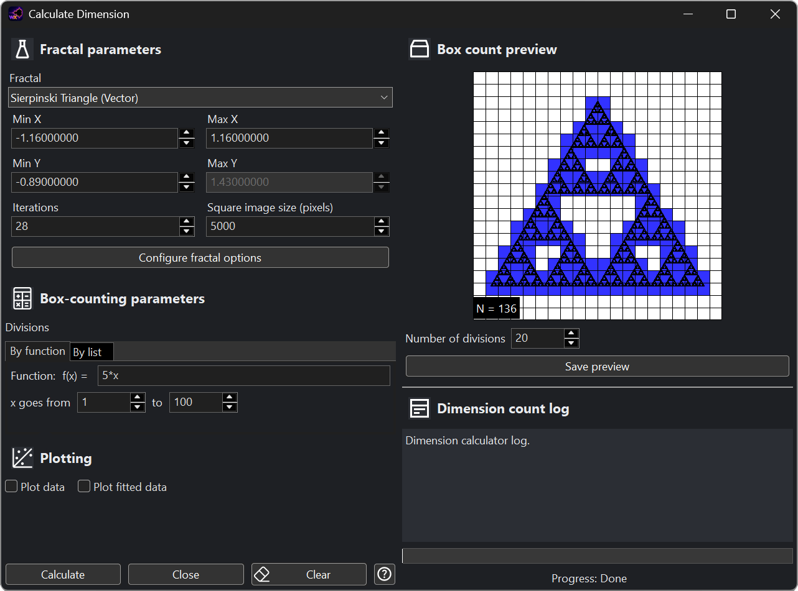
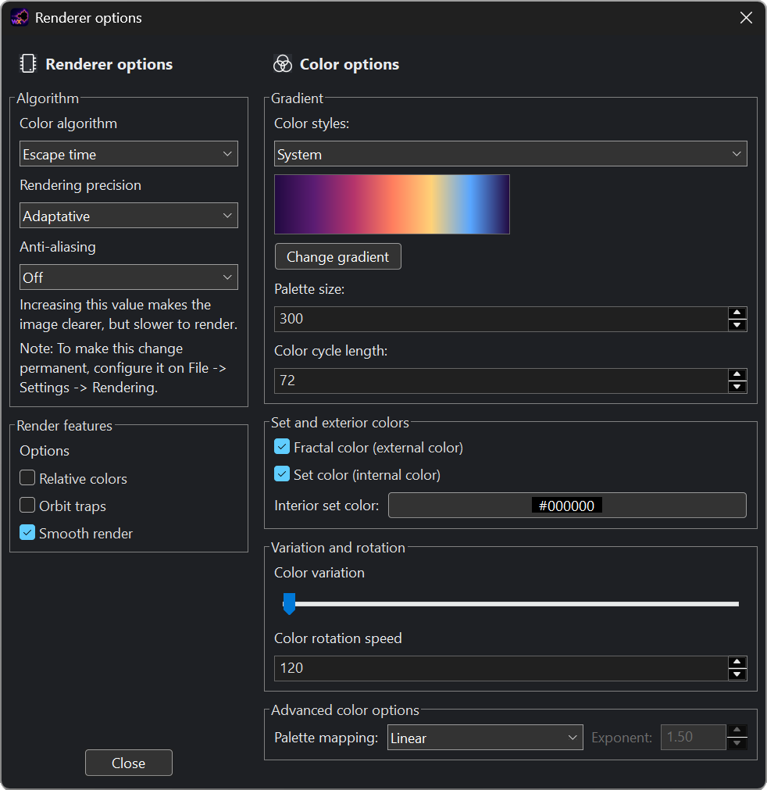
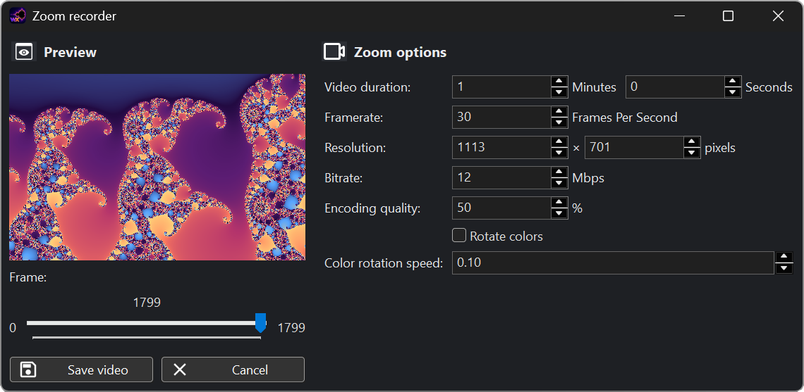

  

  <strong>English</strong>
  &nbsp;|&nbsp;
  <a href="README.es.md">Español</a>
  &nbsp;|&nbsp;
  <a href="README.ja.md">日本語</a>

  <strong>An interactive fractal explorer for discovering, understanding, and creating complex patterns.</strong>

  <a href="https://github.com/CarlosManuelRodr/wxChaos/releases/latest"><strong>Download the latest release</strong></a>
  &nbsp;&middot;&nbsp;
  <a href="Build.md">Build from source</a>
  &nbsp;&middot;&nbsp;
  <a href="https://github.com/CarlosManuelRodr/wxChaos/issues">Report an issue</a>

wxChaos is an open-source application for exploring fractals through direct
interaction. Move through familiar sets, follow the orbit behind a point,
compare rendering methods, open a Julia preview, or examine the mathematics
without leaving the application.

It includes classic complex-plane fractals, chaotic maps, numerical systems,
and vector constructions. The collection ranges from Mandelbrot and Julia sets
to Newton basins, the Burning Ship, the Henon and Logistic maps, the double
pendulum, Sierpinski constructions, and the Koch snowflake.

## What You Can Do

  

- **Explore freely.** Pan, zoom, revisit earlier views, inspect coordinates, and
  move between related parameter and dynamical spaces.
- **See how the image is built.** Display point orbits, select Julia constants,
  inspect values with the point picker, and use interactive documentation that
  connects explanations directly to the application.
- **Change the rendering.** Experiment with palettes, smooth coloring, orbit
  traps, Gaussian-integer coloring, escape angles, triangle inequality, and
  other algorithms supported by each fractal.
- **Create your own fractals.** Enter custom formulas or use the AngelScript
  interface to define complete fractals with options, rendering logic, orbits,
  and their own documentation.
- **Measure and record.** Estimate box-counting dimension, export still images,
  and create videos from a sequence of zooms.
- **Work in your preferred theme and language.** The interface and bundled
  documentation support light and dark themes as well as English and Spanish.

## Learn While Exploring

Every fractal can have its own illustrated documentation page. These pages
introduce the visual idea first, then make the mathematics available when you
want it. Interactive links can open a fractal, change its coloring, enable a
tool, or move directly to a notable location.

Several pages also contain small simulations and iteration labs, so formulas
such as the Mandelbrot iteration, Newton-Raphson method, and double-pendulum
equations can be watched step by step rather than treated as static notation.

## Tools

| Script editor | Dimension calculator |
|:--:|:--:|
| Write and run scripted fractals without rebuilding wxChaos. | Estimate fractal dimension with the box-counting method. |
|  |  |

| Renderer options | Zoom recorder |
|:--:|:--:|
| Choose the coloring algorithm, palette, precision, smoothing, orbit traps, and other rendering controls. | Export a video from a sequence of selected zoom views. |
|  |  |

## Gallery

<table>
  <tr>
    <td></td>
    <td></td>
  </tr>
  <tr>
    <td></td>
    <td></td>
  </tr>
</table>

## Download

Get the newest packaged version from the
[latest GitHub release](https://github.com/CarlosManuelRodr/wxChaos/releases/latest).
Previous versions and release notes are available on the
[releases page](https://github.com/CarlosManuelRodr/wxChaos/releases).

## Build From Source

wxChaos can be built on Windows and Linux using CMake. Dependencies,
configuration options, platform notes, and verified commands are documented in
[Build.md](Build.md).

## Contributing

Bug reports and focused improvements are welcome. Please use the
[issue tracker](https://github.com/CarlosManuelRodr/wxChaos/issues) for problems,
feature ideas, and discussion.

## License

wxChaos is free software licensed under the
[GNU General Public License version 3](License).
